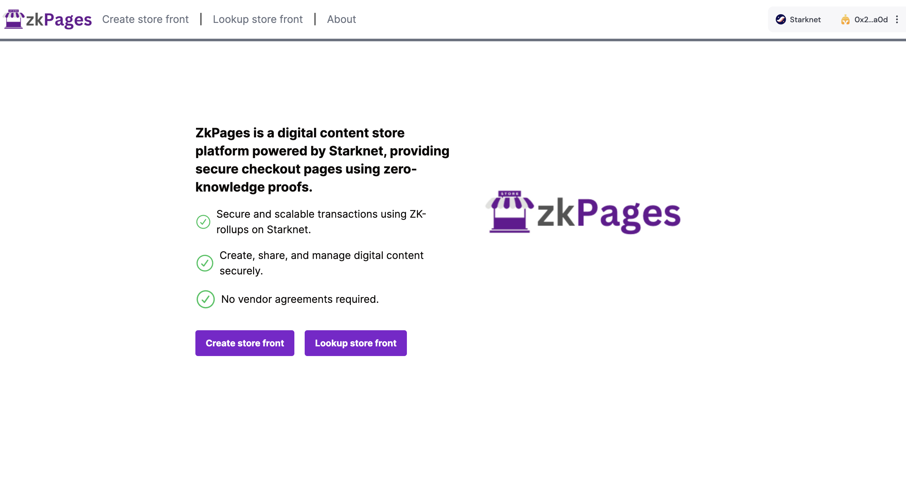
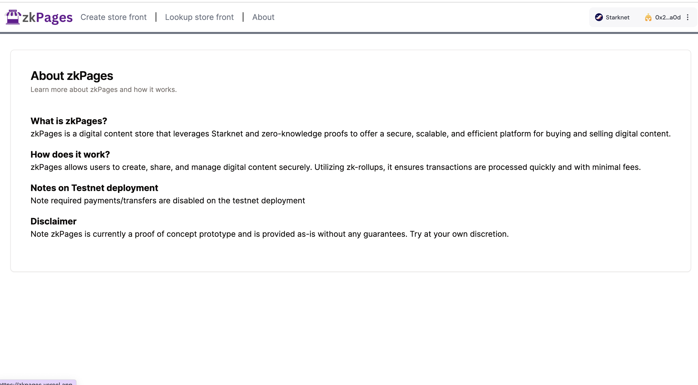
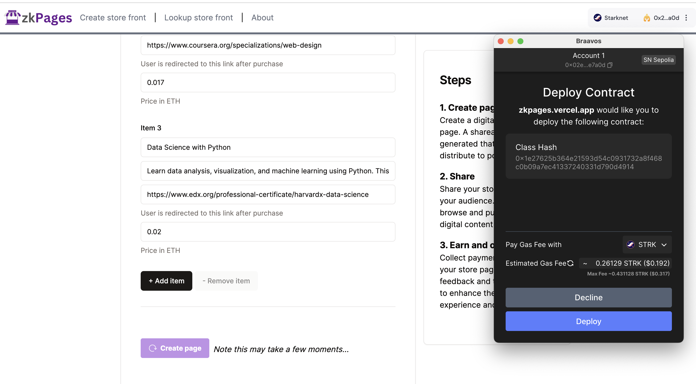
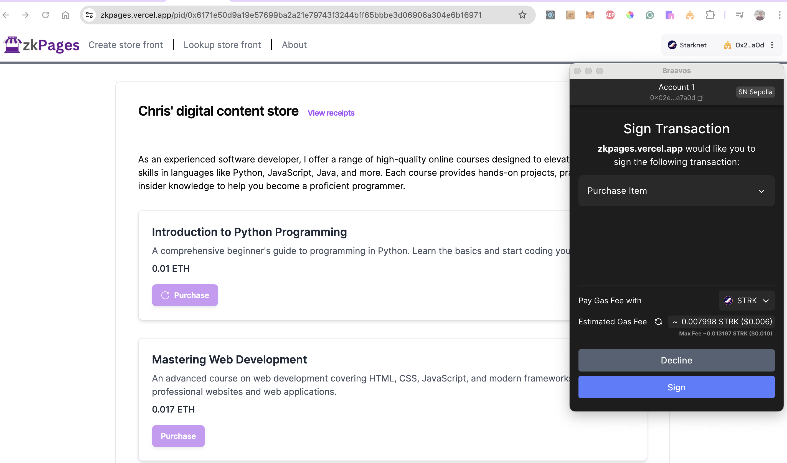
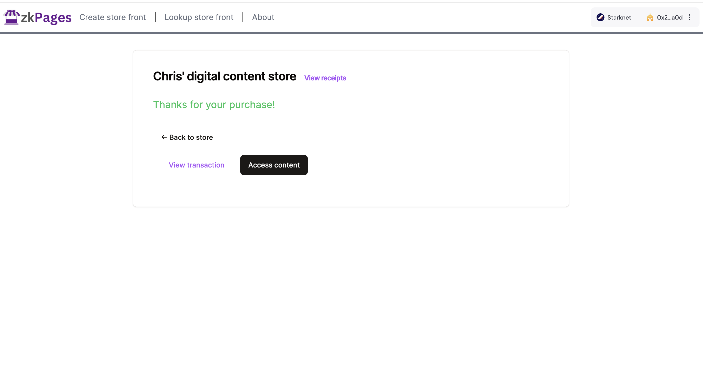
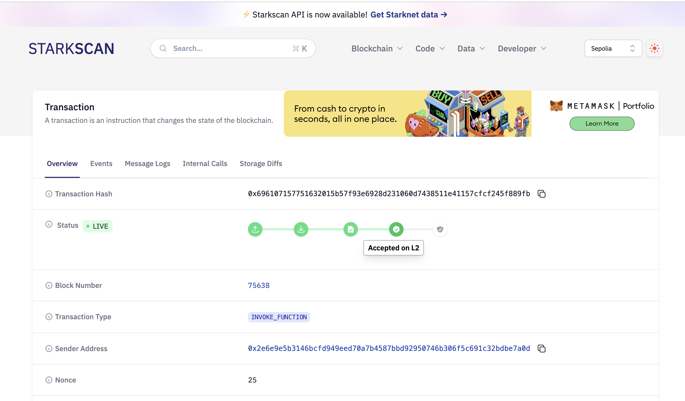
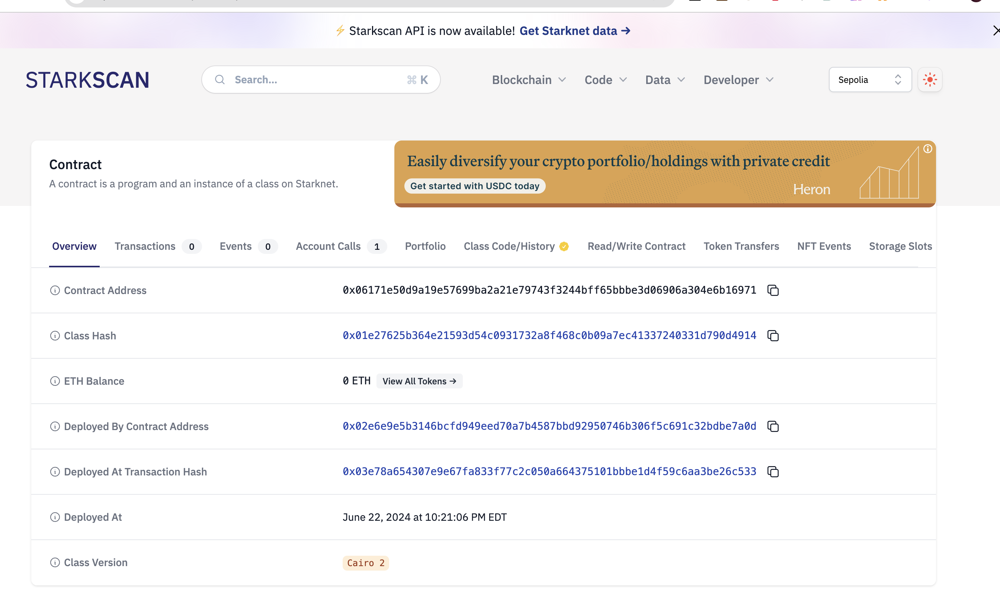
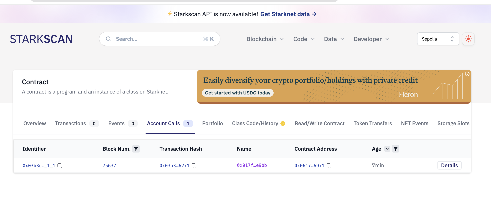
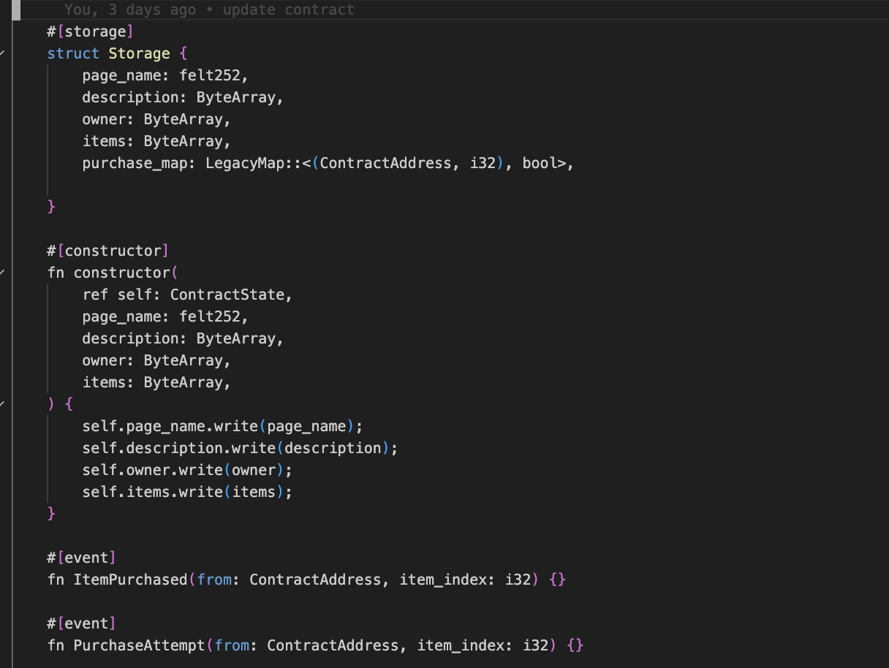
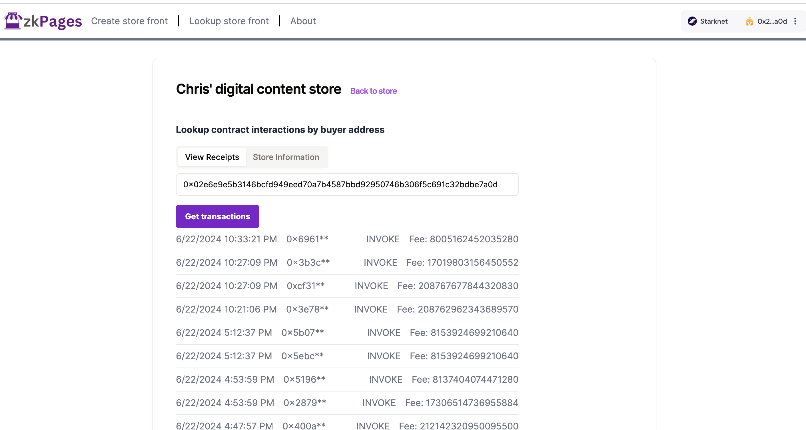

  

 
 

ZkPages
---

Zero-knowledge digital content single-page storefronts on Starknet. ZkPages enables any user to create their own digital content store managed by smart contracts.

Going after the Consumer and Privacy categories for StarkHack 2024.

Live Demo url: https://zkpages.vercel.app (Starknet Sepolia testnet)

Demo video (youtube ~4 minutes): https://youtu.be/HO9kQjtSUjE

### Motivation

Many platforms for building digital content stores exist, but many of them have drawbacks (ex: Gumroad). In particular, those that are based on web2 technologies often require large engineering teams and centralized services for mediation. There's often limitated

We wanted to see if we could use Starknet to solve this prolem. With ZkPages, any consumer can create a self-governing digital content checkout page that enables digital content sales without having to agree to high transaction fees on every sale. Additionally, Starknet has intrinsic benefits as a secure ledger for managing receipts and smart contract execution for processing transactions and redirects for purchases.

### Features

- [x] Single page store front managed by Starknet smart contracts
- [x] Every store has it's own audit history
- [x] Zero knowledge checkout
- [x] Trace-free payments
- [x] Off-platform content support via custom post-purchase links

### Example deployed stores

1.
App-hosted page: https://zkpages.vercel.app/pid/0x6171e50d9a19e57699ba2a21e79743f3244bff65bbbe3d06906a304e6b16971
Contract on explorer: https://sepolia.starkscan.co/contract/0x06171e50d9a19e57699ba2a21e79743f3244bff65bbbe3d06906a304e6b16971

2.
App-hosted page: https://zkpages.vercel.app/pid/0x2bb706159ff3a8395dd4d0ef7de3f7e6bbca22e687fce1536cc19a6be560370
Contract on explorer: https://sepolia.starkscan.co/contract/0x2bb706159ff3a8395dd4d0ef7de3f7e6bbca22e687fce1536cc19a6be560370

#### How it works

ZkPages allows users to create single-page digital content storefronts powered by Starknet smart contracts. The platform emphasizes privacy and security through zero-knowledge checkouts and trace-free payments. Users can easily manage their store, upload content, and track their audit history, ensuring transparency and accountability.

1. Create a Stark account: Start by creating an account on the Starknet network to get access to the zkPages platform.
2. Create a zkPages store: Use the zkPages interface to set up your digital content store. Each store is represented as a single-page storefront.
3. Add digital content: Upload your digital content as items to the store. Content for the purchases can be delivered through custom web2/authenticated links or addressed content through IPFS.
4. Share your store front URL online: Promote your store by sharing the unique URL with your audience.

A contract event gets emitted for each successful purchase that can be tracked and/or audited from other platforms.

### How it's made

zkPages is built on top of the Starknet blockchain, utilizing its scalability and security features. The platform employs zero-knowledge proofs to ensure that checkouts are private and secure, without exposing unnecessary information. Content is stored and delivered via IPFS, a decentralized storage network, which ensures that digital assets are distributed efficiently and reliably. The frontend is designed to be user-friendly, allowing anyone to set up a store with minimal technical knowledge.

When a user accesses a deployed zkPage, he/she has the ability to initiate a private checkout. Upon completion, a contract event gets saved to the zkPage smart contract and the user is redirected to the purchase success url where he/she can access the content. Any guards or security around access (ex: sharing the link with others) should be baked into the url itself, ZkPages does not control or apply any access guards to the url currently otherwise.

<b>Note this app is currently a prototype deployed on the Starknet Sepolia testnet, it would require additional work to be production-ready.</b>

### Technologies used

**Starknet**: Starknet provides the core blockchain infrastructure, providing a scalable and secure environment for managing smart contracts and transactions. Starknet is a key component of zkPages, where every storefront (or zkpage) gets represented as its own smart contract. The network's scalability ensures that zkPages can handle a high volume of transactions without compromising speed. ZK-rollups enable privacy-focused transactions, ensuring that sensitive information remains confidential while verifying the validity of transactions. L2 is also uniquely advantageous to the app to enable checkouts that have permanent receipts as blockchain transactions at low cost.

**Dynamic.xyz**: Dynamic.xyz provides the authentication framework for zkPages, ensuring that only authorized users can access and manage their storefronts. Buyers must also connect their wallets to complete purchases. This integration streamlines the user onboarding process, offering a secure and user-friendly way to log in and interact with the platform. Dynamic.xyz supports various authentication methods, enhancing the security and flexibility of the zkPages platform. Dynamic could be used in the future to easily extend the platform to work on other networks without requiring significant changes to the code.

**Voyager**: Integrated for in-app contract interactions and viewing transaction history, providing users with transparency and auditability of their store's activities. By providing detailed insights into contract interactions and transaction logs, Voyager promotes transparency and accountability within the zkPages ecosystem. Voyager APIs, in particular, enable in-app custom views of blockchain data as transaction receipts without having to leave the app to get information about recent activity with a zkpage contract or look up transactions from particular users on the network.

### Updating the Cairo smart contract

From the `/contracts` folder:

Make any updates to `zkpages.cairo` in the `/src` folder.

Run: `scarb build`

If successful, you should have the casm and sierra output files. Assign the contents into the `casm.ts` and `sierra.ts` object files respectively. The updated contract should now be active in the application.

`./build.sh` will also automatically copy the contents over to the app directory for you.

### Potential Future work

1. Mainnet Deployment: Transition zkPages to the Starknet mainnet, ensuring stability, security, and scalability for real-world usage.

2. Enhance Access Controls: Implement advanced mechanisms like time-limited access links and single-use tokens to prevent unauthorized content sharing.

3. Optimization Controls: Introduce performance optimization features such as caching, load balancing, and efficient data retrieval to handle high traffic.

4. Expanded Payment Options: Integrate additional payment gateways and support various cryptocurrencies and fiat currencies for broader accessibility.

5. Advanced Analytics and Reporting: Develop tools for tracking visitor behavior, sales performance, and other key metrics to help store owners optimize their storefronts

### Screenshots

## Home Page

The landing page of our application, providing an overview and easy navigation.

## About Us

Additional information about the project and the testnet prototype.

## Deploy

Deploying a new contract storefront.

## Purchase Process
### Purchase

Steps to make a purchase through a store front page (zkpage).

### Purchased

Confirmation and details of a successfully completed purchase.

## Transactions

Overview of recent transactions and their statuses.

## Storefront Page

Screenshot of our storefront page, showcasing products and services.

## Storefront Contract

Example screenshot of a zkpage contract deployed for each store, ensuring secure and efficient operations.

## Contract calls

Example calls on a deployed zkpage contract

## Cairo smart contract

Screenshot of the zkpage smart contract logic (search `zkpage.cairo` in the github)

## Viewing store receipts on chain

Viewing receipts for completed transactions on a given address against a zkpage contract in app.

### License

MIT

