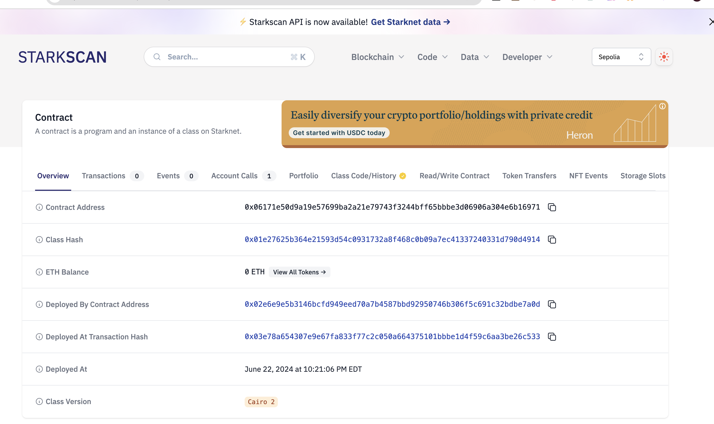

    

## ZkPages

Mediated proof of fund requests managed by Lisk smart contracts with saved signatures of record.

Going for the Real world applications and finance category of https://lisk.devpost.com/

Live Demo url:

Demo video (youtube ~3 minutes):

### Inspiration

Many high value purchases warrant proof of funds requests to know if a given offer or potential buyer is serious.

With ZkPages, you can prove or assert you have a certain balance on connected wallets without exposing bank statements or keys to the requester. ZkPages generates a proof point at the time of attestation / verification that can be shared with the requester with a signature hash saved to the contract.

Example of this process in real estate: <a href="https://www.investopedia.com/ask/answers/082316/how-do-mortgage-lenders-check-and-discover-bank-statements.asp#:~:text=A%20proof%20of%20deposit%20is,closing%20costs%20for%20a%20property." target="_blank"> Proof of funds</a>

### Example signed verification request

Contract: https://sepolia-blockscout.lisk.com/address/0x9189c7722C0B815cd3752d559aD10980E20e59B4

Signature page: https://zkpageslisk.vercel.app/pid/0x9189c7722C0B815cd3752d559aD10980E20e59B4 (only viewable with designated recipient address).

### Example use case

* **Buyers:**
    * Securely connect their wallets, showing ownership over particular accounts.
    * Generate smart contract transactions and sign protocol attestations demonstrating sufficient funds for a specific transaction, without revealing additional or personal details.
    * Share these proofs with sellers or realtors for verification.
* **Sellers and Realtors:**
    * Discover proofs using the app to confirm a buyer's financial eligibility for a smooth pre-qualification process.
    * Expedite serious offers by eliminating the need for lengthy document verification.

When a store front is created, a smart contract gets deployed marking the information around the store front. The address of the smart contract serves as part of a unique url which can be shared with the recipient or verifier - only the intended recipient can validate their balance and create an attestation to be shared with the seller.

When the verification is complete, a blockchain event is also emitted with information about the validation. This event can be listened to on other networks or blockchain platforms (or for indexing on `the Graph` as well).

### Technologies used

**Filecoin**: Used for secure file storage for additional material related to the fund request. When the other party visits the authenticated store front link, he or she can access the uploaded material related to the purpose of the upload. This is also secured with saturn and uses lighthouse web3 sdk underneath for both upload and download based on the cid. Created cids are saved to the smart contracts and are retrieved when the verification page is accessed. The cid is only revealed to the authorized parties (owner and recipient) for each smart contract / transaction.

<a href="https://gateway.lighthouse.storage/ipfs/QmeSUzMZSmUnj56WkriWwHjWqtJyarFX41EkPdscrQusuy">Example uploaded document</a>

This app was deployed and supports Lisk Sepolia and Ethereum mainnet. Depending on the use case, the event fired from the contract when verification is completed can be used to trigger separate blockchain-specific workflows.

### How to run

1. Fill in values in `.env.sample`, copy to a new file `.env`.

2. `yarn; yarn dev`

The app should now be running on port 3000.

### Updating the smart contract

1. Update `StoreContract.sol` in `/StoreContract/contracts`

2. Install dependencies via yarn in root folder. Run `npx hardhat compile` from `/StoreContract`

3. Copy contents (includes ABI) to `metadata.tsx#PAGE_CONTRACT`

4. Rebuild web project. The app should now be using the updated contract code.

### Potential future work

1. Enhanced Smart Contract Functionality: Implementing advanced smart contract functionalities to automate and streamline fund verification processes further, reducing manual evaluation / communication such as emailing.

2. Expanded Blockchain Support: Adding support for additional blockchain networks and protocols to broaden ZkPages's reach and accessibility, catering to users across different blockchain ecosystems.

3. Integration of Advanced Security Features: Integrating advanced security features such as zero-knowledge proofs to further validate the viewer of a contract.

### Useful links

# Image gallery

## Home

## About page

## Creating a new fund request

## Request created

## Insufficient balance error

## Access error (not designated recipient)

## Example Filecoin IPFS Upload

## Verified

## Smart Contract code sample

<!--
ZkPages
Demo:
* If you've ever bought a hom
* Intro of proof of funds
* Talk about integrating sponsors
* Increase accessibility. Speed up the process and eliminate the human back and forth for authentication.
* Proof of record stored transparently.
Creation
* Every request gets it's own smart contract
* Filecoin manages data hosting for attachments. This could include things like the bank letter or similar to still include to the signer.
* Enter how much funds you want the individual to prove.
Deploy
* Describe what is happening
* Link you could share via email. Say to complete at convenience.
Sign
* Authentication
* Completely managed by the previous smart contract
* Describe different benefits of using contract record
* Show blockchain smart contract record
* Sign protocol emit with a hash of the signature.
* Need to demonstrate sufficient balance.
* Event is emitted on sign, can be tracked or monitored externally
Github
Code is open source
Prototype is live.
 -->
